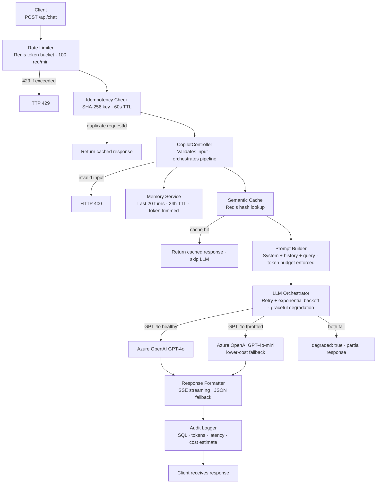

# copilot-plugin-api
A production-grade Copilot-style conversational API built in C# / .NET 8 with Azure OpenAI, Redis, and SQL — designed for reliability, cost control, and LLM inference at scale.

## Badges


## Architecture Overview


## Key Design Decisions
- **Context-aware memory**: Redis-backed session history capped at 20 turns with 24h TTL and dynamic token trimming. This prevents unbounded Redis growth and keeps prompts within the model context window.
- **Semantic caching**: Prompt hash lookup in Redis before every LLM call. This eliminates redundant inference calls and directly reduces token cost.
- **Idempotent request handling**: SHA-256 keyed deduplication with 60s TTL. This handles network retries and client double-submits without duplicate LLM calls.
- **Graceful degradation**: LLM orchestrator retries GPT-4o with exponential backoff, falls back to GPT-4o-mini, and returns a partial response if both fail. The service does not return a hard 500 during normal throttling and dependency failure paths.
- **Cost visibility**: Every request logs token count, model used, and a cost estimate to SQL. This enables cost-per-user analysis and cache hit rate tracking over time.

## Tech Stack
| Layer | Technology |
| --- | --- |
| Runtime | .NET 8 (C#) — current LTS, Microsoft-native |
| Web framework | ASP.NET Core Minimal API + Controllers |
| LLM primary | Azure OpenAI — GPT-4o (gpt-4o deployment name) |
| LLM fallback | Azure OpenAI — GPT-4o-mini (lower-cost fallback) |
| Cache / memory | Redis 7 via StackExchange.Redis |
| Audit database | SQLite (local dev) / PostgreSQL (prod-ready) |
| ORM | Entity Framework Core 8 |
| Token counting | Microsoft.ML.Tokenizers (tiktoken-compatible) |
| Containerisation | Docker + docker-compose |
| Streaming | Server-Sent Events (SSE) via IAsyncEnumerable |
| Testing | xUnit + Moq |

## Prerequisites
- .NET 8 SDK
- Docker and docker-compose
- Azure OpenAI resource with `gpt-4o` and `gpt-4o-mini` deployments

## Local Setup

```bash
cp .env.example .env
# Open .env and fill in:
#   AzureOpenAI__ApiKey   — your Azure OpenAI API key
#   AzureOpenAI__Endpoint — your Azure OpenAI endpoint URI
#   AzureOpenAI__PrimaryDeployment=gpt-4o
#   AzureOpenAI__FallbackDeployment=gpt-4o-mini

docker-compose up -d
dotnet run --project src/
```

Four commands. That is the entire local setup.

> **Production note:** In production, supply environment variables directly through
> your orchestrator (Kubernetes, Azure App Service, etc.) — do not deploy a `.env` file.

## API Usage
Request:
```bash
curl -X POST http://localhost:8080/api/chat \
  -H "Content-Type: application/json" \
  -d '{
    "userId": "user-123",
    "sessionId": "session-abc",
    "requestId": "550e8400-e29b-41d4-a716-446655440000",
    "message": "Summarise the last sprint retrospective"
  }'
```

Success response:
```json
{
  "response": "The last sprint retrospective covered...",
  "cacheHit": false,
  "degraded": false,
  "modelUsed": "gpt-4o",
  "promptTokens": 412,
  "completionTokens": 187,
  "latencyMs": 1243.5
}
```

Rate limit response:
```http
HTTP/1.1 429 Too Many Requests
Retry-After: 60
Content-Type: application/json

{
  "error": "Rate limit exceeded",
  "retryAfterSeconds": 60
}
```

## Environment Variables
| Variable | Required | Description |
| --- | --- | --- |
| `AzureOpenAI__ApiKey` | Yes | Authenticates requests to the Azure OpenAI resource. Maps to `AzureOpenAI:ApiKey` via the ASP.NET Core double-underscore convention. |
| `AzureOpenAI__Endpoint` | Yes | Specifies the Azure OpenAI endpoint URI. Maps to `AzureOpenAI:Endpoint`. |
| `AzureOpenAI__PrimaryDeployment` | No | Overrides the primary deployment name from `appsettings.json`. Defaults to `gpt-4o`. |
| `AzureOpenAI__FallbackDeployment` | No | Overrides the fallback deployment name from `appsettings.json`. Defaults to `gpt-4o-mini`. |
| `DATABASE_PROVIDER` | No | Selects the SQL provider. Supported values are `sqlite` and `postgresql`. Defaults to `sqlite`. |
| `DATABASE_CONNECTION_STRING` | Yes | Supplies the SQLite or PostgreSQL connection string used by Entity Framework Core. |
| `Redis__ConnectionString` | No | Overrides the Redis connection string from `appsettings.json`. Defaults to `localhost:6379`. |
| `ASPNETCORE_ENVIRONMENT` | No | Sets the hosting environment. Use `Development` locally, `Production` in deployment. |
| `ASPNETCORE_URLS` | No | Sets the listen address. Defaults to `http://+:8080` in Docker. |

## Project Structure
```text
copilot-plugin-api/
├── src/
│   ├── Configuration/
│   │   ├── AzureOpenAIConfig.cs
│   │   ├── CostsConfig.cs
│   │   ├── MemoryConfig.cs
│   │   ├── PromptConfig.cs
│   │   ├── RateLimitConfig.cs
│   │   ├── RedisConfig.cs
│   │   └── SemanticCacheConfig.cs
│   ├── Controllers/
│   │   └── CopilotController.cs
│   ├── Data/
│   │   ├── AppDbContext.cs
│   │   └── AuditLogger.cs
│   ├── Models/
│   │   ├── ChatRequest.cs
│   │   ├── ChatResponse.cs
│   │   ├── ConversationTurn.cs
│   │   └── LlmResult.cs
│   ├── Services/
│   │   ├── IdempotencyService.cs
│   │   ├── LlmOrchestratorService.cs
│   │   ├── MemoryService.cs
│   │   ├── PromptBuilderService.cs
│   │   ├── RateLimiterService.cs
│   │   └── SemanticCacheService.cs
│   ├── CopilotPluginApi.csproj
│   └── Program.cs
├── tests/
│   └── CopilotApi.Tests/
│       ├── RateLimiterTests.cs
│       ├── IdempotencyTests.cs
│       ├── MemoryServiceTests.cs
│       └── LlmOrchestratorTests.cs
├── .dockerignore
├── .env.example
├── .gitignore
├── Dockerfile
├── docker-compose.yml
├── appsettings.json
├── CopilotPluginApi.sln
└── README.md
```

## License
MIT
